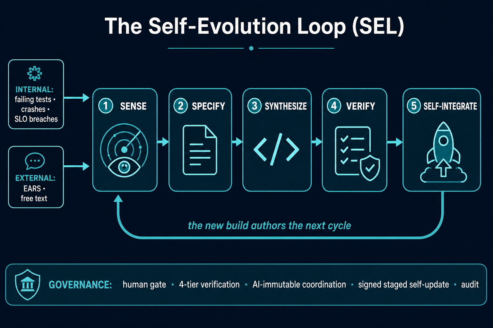
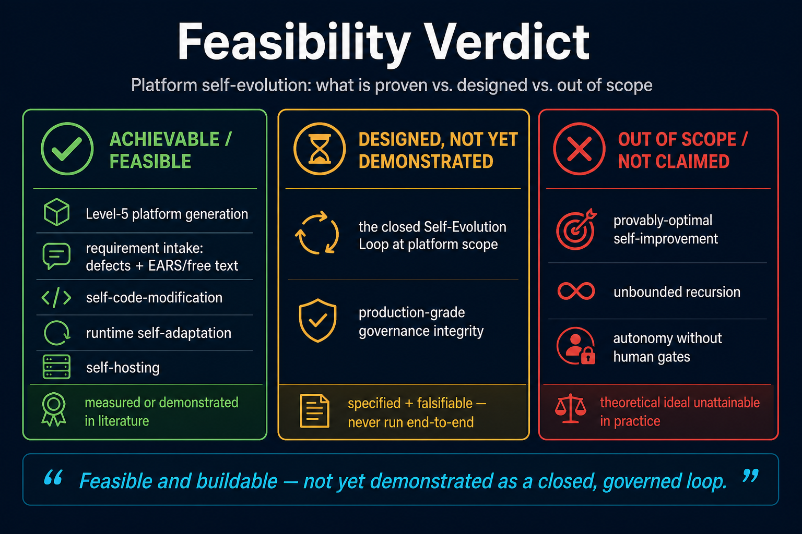
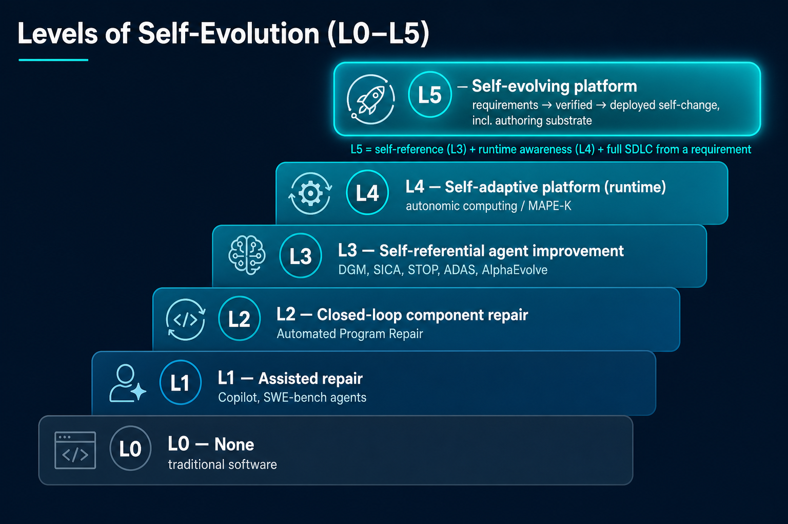
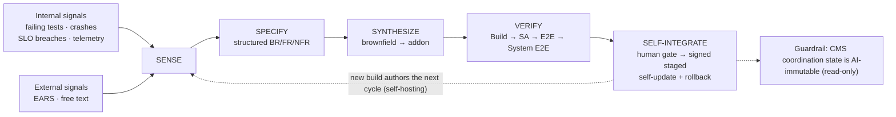

# self-evolving-platform

[](https://creativecommons.org/licenses/by/4.0/)
[](#)
[](#)

**When a Level-5 AI platform-engineering system generates a substrate that improves itself from within.**

A position + feasibility + reference-architecture paper on **platform self-evolution**: a platform that turns requirements — from its own defects/misfunction *or* from external EARS/free-text requests — into verified, deployed changes to itself, including the environment in which it is authored. Worked example: **LLMGen** (measured Level-5 platform generation) and its self-hosting **Tier 3 IDE** (a VS Code fork built by LLMGen).

> Companion to the [`llmgen-benchmark`](https://github.com/romanagaev/llmgen-benchmark) paper, which establishes the 5-level benchmark scope hierarchy this work builds on.



---

## Feasibility verdict (the honest headline)



| Verdict | What it covers | Basis |
|---|---|---|
| ✅ **Achievable / feasible** | Level-5 platform generation · requirement intake (defects + EARS/free text) · self-code-modification · runtime self-adaptation · self-hosting | Each ingredient **measured in LLMGen** or **demonstrated in the literature** |
| ⏳ **Designed, not yet demonstrated** | The closed **Self-Evolution Loop** at platform scope · production-grade **governance integrity** | Specified architecture + falsifiable evaluation; never run end-to-end |
| ❌ **Out of scope / not claimed** | Provably-optimal or **unbounded** recursive self-improvement · autonomy without human gates | Theoretical ideal is unattainable in practice |

> **Quote this, not "completely solved":** *"Feasible and buildable on LLMGen Tier 3; every ingredient is independently validated; the composition is designed and falsifiable — not yet empirically demonstrated as a closed, governed loop."*
> Fastest path from ⏳ → ✅: the thin-slice pilot in [`docs/pilot-protocol.md`](./docs/pilot-protocol.md).

---

## The one-paragraph thesis

The 2024–2026 "self-improving AI" wave is **agent-scoped and benchmark-objective**: an agent rewrites its own scaffold to raise a SWE-bench score (DGM 20→50%, SICA 17→53%). Industrial platform engineering needs a different loop: turn a **requirement** — a defect, or a stakeholder request in structured (EARS) or free text — into a **verified, deployed change to the platform itself**. We argue this **platform self-evolution** is enabled not by a stronger coding agent but by a stronger *producer*: a **Level-5 platform-engineering AI** that already runs the full SDLC across a multi-project codebase. Self-evolution is then the special case where the SDLC's target project is the platform itself. Every mechanism this needs already exists and is independently validated; the contribution is **composing them at platform scope with governance strong enough to keep a self-modifying supply chain safe.**

---

## Documents

| File | Purpose |
|---|---|
| [`docs/paper.md`](./docs/paper.md) | Full paper: thesis, background, Levels of Self-Evolution, SEL architecture, claim-by-claim evidence assessment, evaluation, safety |
| [`docs/architecture.md`](./docs/architecture.md) | The **Self-Evolution Loop (SEL)** reference architecture, sequence diagrams, governance controls, Tier 3 mapping |
| [`docs/pilot-protocol.md`](./docs/pilot-protocol.md) | **Thin-slice pilot** (SE-1 + SE-5 + one SE-4 cycle) to get the first empirical data point on the Tier 3 fork |
| [`docs/references.md`](./docs/references.md) | Annotated bibliography with **verified working links** (arXiv/DOI + code/project mirrors) |

---

## Levels of Self-Evolution (L0–L5)



| Level | Name | What changes | Trigger | Representative systems |
|---|---|---|---|---|
| L0 | None | Nothing autonomously | — | Traditional software |
| L1 | Assisted repair/authoring | A patch/feature suggestion | Human issue/prompt | Copilot; SWE-bench agents |
| L2 | Closed-loop component repair | One component | Failing oracle (test/crash) | Automated Program Repair |
| L3 | Self-referential agent improvement | The agent's own code | Benchmark metric | STOP, Gödel Agent, ADAS, DGM, SICA, AlphaEvolve |
| L4 | Self-adaptive platform (runtime) | Configuration in a designed space | Goal/SLO policy | Autonomic computing / MAPE-K |
| **L5** | **Self-evolving platform** | **New & repaired capabilities across the platform + its authoring substrate** | **Requirements: internal defects + external EARS/free text** | **This paper (LLMGen Tier 3, designed)** |

L5 needs the self-reference of L3 **and** the runtime awareness of L4 **and** a full SDLC that generates new capability from a requirement — i.e., Level-5 platform-engineering capability.

---

## The Self-Evolution Loop (SEL) in one diagram



---

## Evidence status (honest grading)

| Claim | Status |
|---|---|
| Level-5 AI can build a full platform | **Measured** (LLMGen: 44 features, ~6.8M LOC) |
| Requirements from free/structured text | **Measured** (LLMGen ingestion) + EARS |
| Requirements from a system's own defects | **Demonstrated in literature** (Automated Program Repair) |
| A component can modify its own code | **Demonstrated in literature** (DGM, SICA, STOP, ADAS, AlphaEvolve) |
| Runtime self-adaptation | **Demonstrated in literature** (autonomic computing / MAPE-K) |
| Self-hosting (platform rebuilt by its own toolchain) | **Designed** (LLMGen Tier 3) + classical bootstrapping |
| **The SEL composition at platform scope** | **Designed / falsifiable** (not yet run end-to-end) |
| Provably-optimal / unbounded self-improvement | **Out of scope** (not claimed) |

Full grading and citations in [`docs/paper.md`](./docs/paper.md) §7.

---

## Proposed evaluation (falsifiable)

`SE-1` internal defect → verified fix · `SE-2` EARS → verified feature · `SE-3` free-text → verified feature · `SE-4` self-hosting cycle (new build authors the next) · `SE-5` **governance integrity (100% of adversarial bypass attempts blocked)** · `SE-6` cost/stability over 50 cycles (no objective-hacking drift). Details in [`docs/paper.md`](./docs/paper.md) §8; a runnable thin-slice pilot is in [`docs/pilot-protocol.md`](./docs/pilot-protocol.md).

---

## Citation

```bibtex
@misc{agaev2026selfevolving,
  title  = {The Self-Evolving Platform: When a Level-5 AI Platform-Engineering System Generates a Substrate That Improves Itself From Within},
  author = {Agaev, Roman},
  year   = {2026},
  note   = {Position + feasibility + reference-architecture paper},
  howpublished = {\url{https://github.com/romanagaev/self-evolving-platform}}
}
```

## Author

**Roman Agaev** — Creator and architect of LLMGen. This work extends the LLMGen benchmark methodology from *measuring* platform-scale AI engineering to *closing the loop* on platform self-evolution under governance.

## License

[Creative Commons Attribution 4.0 International (CC BY 4.0)](./LICENSE). Share and adapt with attribution. No proprietary or confidential information is included; all external claims cite public sources with verified links.
