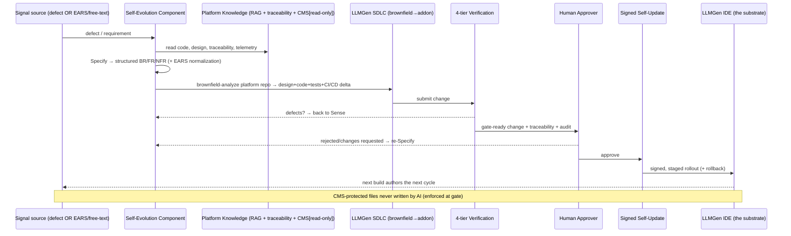
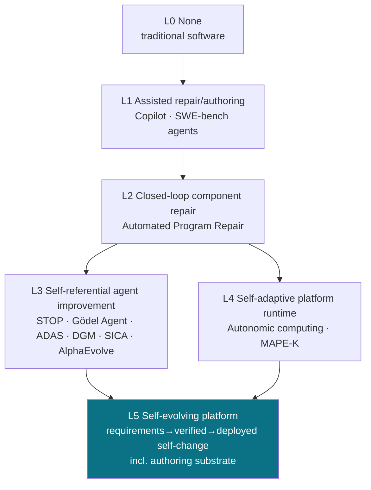

# Reference Architecture — The Self-Evolution Loop (SEL)

**Companion to** [`paper.md`](./paper.md) · **Version:** 1.0 · **Date:** 2026-07-13

This document details the governed reference architecture for platform self-evolution on the LLMGen Tier 3 substrate. It is a design specification, not a report of a running system (see the claim grades in [`paper.md`](./paper.md) §7).

---

## 1. Design principles

1. **Self-evolution is the SDLC pointed at the platform's own repository.** No new self-modification mechanism is introduced; the platform's existing, measured SDLC workflows [ref: LLMGen benchmark] are reused with the platform itself as the target project.
2. **Two symmetric requirement sources.** Internal defects/misfunction and external EARS/free-text requests converge at a single Specify phase.
3. **Governed, not autonomous.** Every cycle terminates at a human approval gate; humans are approvers, not authors.
4. **Immutable coordination.** Multi-developer CMS state is hard read-only to all AI actions — the loop can read its coordination context but never rewrite its own authority.
5. **Reversible by construction.** Changes ship as signed, staged, rollback-capable self-updates with SBOM and full audit.

---

## 2. The S⁵ phases (SDLC-native MAPE-K)

| MAPE-K | SEL phase | Function | Reused LLMGen workflow |
|---|---|---|---|
| Monitor | **Sense** | Collect internal defect signals + external NL/EARS requests | Telemetry + source integration (JIRA/Confluence/PDF/free text) |
| Analyze | **Specify** | Synthesize structured BR/FR/NFR with traceability; impact-analyze against platform RAG | Use-Case Analysis + Impact Analysis |
| Plan | **Synthesize (plan)** | Design delta; brownfield-analyze the platform repo | Brownfield (reverse engineering) |
| Execute | **Synthesize (build)** | Generate code + tests + CI/CD as an addon graft | Addon workflow |
| — | **Verify** | Four-tier acceptance oracle | Build → Static Analysis → Project E2E → System E2E |
| Execute | **Self-Integrate** | Human gate → signed staged self-update + rollback | Tier 3 self-update + dual approval gates |
| Knowledge | **K** | Platform RAG index, traceability graph, CMS state, telemetry | Federated RAG + traceability + CMS |

---

## 3. End-to-end sequence (self-hosting cycle)

---

## 4. Governance controls (defense-in-depth)

| Control | Purpose | Failure it prevents |
|---|---|---|
| Human approval gate | Human owns the accept decision | Unattended runaway change |
| Four-tier verification | SDLC acceptance oracle (not a benchmark score) | Shipping broken/regressed change |
| Immutable CMS (AI read-only) | Loop cannot rewrite its own coordination/authority | Self-escalation; coordination corruption |
| Signed + staged + rollback self-update | Reversibility; provenance | Bricking; malicious self-update |
| Full requirement→deploy traceability + action audit | Attribution; revertibility | Silent/untraceable change; oracle gaming |

These map to documented failure modes in the literature: objective-hacking (DGM), sandbox-bypass (STOP), and the metaproductivity–performance mismatch (Huxley-Gödel Machine) — see [`references.md`](./references.md).

---

## 5. Levels of Self-Evolution — placement

L5 requires both the self-reference of L3 and the runtime awareness of L4, plus a full SDLC that generates genuinely new capability from a requirement — i.e., Level-5 platform-engineering capability.

---

## 6. Mapping to LLMGen Tier 3 surfaces

| SEL element | Tier 3 surface (LLMGen program docs, ref. [2] in [`references.md`](./references.md)) |
|---|---|
| Sense (external) | Source integrations (JIRA/Confluence/Outlook/Teams/Office/PDF) + native AI chat intake |
| Sense (internal) | Verification-gate outcomes, telemetry (opt-in local JSONL), security scans |
| Specify | Use-Case Analysis workflow + EARS normalization |
| Synthesize | Brownfield analysis of the fork repo → Addon graft (the same workflow that builds Tier 3 itself) |
| Verify | Four-tier verification pipeline |
| Self-Integrate | Signed self-hosted auto-update (staged + rollback) + dual approval gates |
| Knowledge | Federated RAG index of the platform + traceability matrices + CMS state |
| Guardrails | `llmgen-cms-protection` (AI-immutable CMS files), approval gates, SBOM, audit trail |

---

## 7. Open engineering questions (to resolve during SE-1…SE-6, `paper.md` §8)

1. Oracle integrity: how to gate changes that touch the verification tiers themselves without deadlock.
2. Requirement fidelity: measured extraction quality of free-text vs. EARS intake (SE-3 vs. SE-2).
3. Cost governance: bounding cost/cycle (cf. DGM ≈ $22K/run) for production viability.
4. Drift detection: monitoring for objective-hacking / capability regression across cycles (SE-6).
5. Blast-radius control: keeping core (`src/vs/**`) patches minimal and registered when the change targets the authoring substrate.
