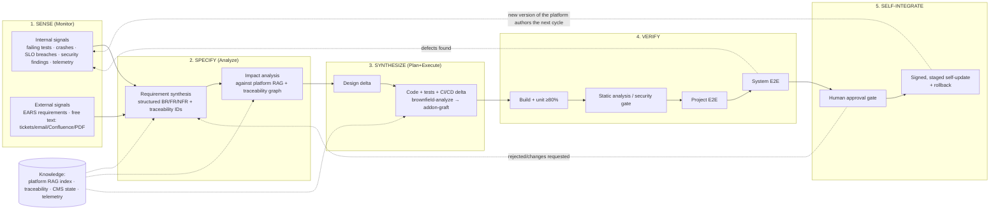

# The Self-Evolving Platform: When a Level-5 AI Platform-Engineering System Generates a Substrate That Improves Itself From Within

**Roman Agaev**
Independent Platform Engineer / Creator of LLMGen

**Version:** 1.0 · **Date:** 2026-07-13 · **Type:** Position + feasibility + reference architecture paper
**License:** CC BY 4.0

---

## Feasibility Verdict (read this first)

> **Platform self-evolution is _achievable and buildable_ on the LLMGen Tier 3 substrate — but it is not yet _demonstrated_, and it is _not_ a claim of unbounded self-improvement.** The paper's contribution is an integration thesis with a falsifiable test, not a running result. The three-way calibration below is the honest headline; the full claim-by-claim grading is in [§7](#7-claims-and-evidence-assessment).

| Verdict | What it covers | Basis |
|---|---|---|
| ✅ **Achievable / feasible** | Level-5 platform generation; requirement intake (defects + EARS/free text); self-code-modification; runtime self-adaptation; self-hosting | Each ingredient is **measured in LLMGen** or **demonstrated in the literature** (grades [M]/[L], §7 C1–C6) |
| ⏳ **Designed, not yet demonstrated** | The closed **Self-Evolution Loop (SEL)** at platform scope; production-grade **governance integrity** of a self-modifying supply chain | Specified architecture (§5) + falsifiable evaluation (§8); grades [D], §7 C7–C8 — never run end-to-end |
| ❌ **Out of scope / not claimed** | Provably-optimal or **unbounded** recursive self-improvement; autonomy without human gates | Theoretical ideal (Gödel Machine [5]) is unattainable in practice; grade [S], §7 C9 |

**One-line claim to quote:** *"Feasible and buildable on LLMGen Tier 3; every ingredient is independently validated; the composition is designed and falsifiable — not yet empirically demonstrated as a closed, governed loop."* The fastest path from ⏳ to ✅-demonstrated is the thin-slice pilot in [`pilot-protocol.md`](./pilot-protocol.md) (SE-1 + SE-5 + one SE-4 self-hosting cycle).

---

## Abstract

Contemporary work on self-improving AI operates at the scope of a *single agent optimizing a benchmark score*: a scaffold rewrites its own tools to raise pass-rates on SWE-bench or Polyglot [6, 8, 9, 10]. In parallel, a separate and older literature on *self-managing software* — autonomic computing and self-adaptive systems — lets a deployed system self-configure, self-heal, and self-optimize within a **pre-designed adaptation space** [3, 4]. Neither line closes the loop that industrial platform engineering actually needs: turning **new requirements** — whether inferred from the system's own defects and misfunction, or supplied from outside as structured (EARS) or free natural-language text — into **verified, deployed changes to the platform's own substrate**, including the environment in which the platform is authored. We argue that this capability, which we call **platform self-evolution**, becomes reachable specifically when the system is *produced by* a **Level-5 platform-engineering AI** (per the benchmark hierarchy of Agaev 2026 [1]) rather than a Level-2 coding agent. Using LLMGen — an AI platform-engineering system with measured Level-5 output (44 features, ~6.8M LOC across a 117-day deployment [1]) and a designed self-hosting IDE (Tier 3, an LLMGen-built fork of VS Code [2]) — as the worked example, we (1) formalize platform self-evolution as an SDLC-native generalization of the MAPE-K control loop; (2) propose **Levels of Self-Evolution (L0–L5)**, an ontology analogous to the Levels of AGI [18] and SAE driving automation; (3) present a **governed reference architecture** (the *Self-Evolution Loop*, SEL) in which a self-evolution component ingests internal defect signals and external EARS/free-text requirements, drives the same requirements→design→code→test→CI/CD→deploy workflow the platform uses for any other project, and applies the result to the platform itself under human approval gates, immutable coordination state, four-tier verification, and signed staged self-update. We assess every constituent claim against the current literature and against LLMGen's measured capabilities, grading each as *demonstrated in literature*, *measured in LLMGen*, *designed/feasible*, or *speculative*. We conclude that platform self-evolution is not a new theoretical breakthrough but an **integration thesis**: each ingredient exists and is validated independently; the open contribution is composing them at platform scope with governance sufficient to keep a self-modifying software supply chain safe and auditable.

**Keywords:** self-evolving software, recursive self-improvement, autonomic computing, self-adaptive systems, AI platform engineering, self-hosting, automated program repair, requirements engineering, EARS, AI governance

---

## Table of Contents

1. [Introduction](#1-introduction)
2. [Background and Related Work](#2-background-and-related-work)
   - 2.1 [Self-improving agents (agent-scope, benchmark-objective)](#21-self-improving-agents-agent-scope-benchmark-objective)
   - 2.2 [Self-managing software (autonomic computing and self-adaptive systems)](#22-self-managing-software-autonomic-computing-and-self-adaptive-systems)
   - 2.3 [Automated program repair and requirements from defects](#23-automated-program-repair-and-requirements-from-defects)
   - 2.4 [Requirements from natural language: EARS and free text](#24-requirements-from-natural-language-ears-and-free-text)
   - 2.5 [The gap](#25-the-gap)
3. [Definitions and the Self-Evolution Thesis](#3-definitions-and-the-self-evolution-thesis)
4. [Levels of Self-Evolution (L0–L5)](#4-levels-of-self-evolution-l0l5)
5. [Reference Architecture: The Self-Evolution Loop (SEL)](#5-reference-architecture-the-self-evolution-loop-sel)
   - 5.1 [SEL as an SDLC-native MAPE-K](#51-sel-as-an-sdlc-native-mape-k)
   - 5.2 [Requirement sources: internal misfunction and external text](#52-requirement-sources-internal-misfunction-and-external-text)
   - 5.3 [The self-hosting property: evolving the substrate that authors the platform](#53-the-self-hosting-property-evolving-the-substrate-that-authors-the-platform)
   - 5.4 [Governance: guardrails for a self-modifying supply chain](#54-governance-guardrails-for-a-self-modifying-supply-chain)
6. [Why Level 5 Is the Enabling Condition](#6-why-level-5-is-the-enabling-condition)
7. [Claims and Evidence Assessment](#7-claims-and-evidence-assessment)
8. [Evaluation Proposal](#8-evaluation-proposal)
9. [Risks, Limits, and Safety](#9-risks-limits-and-safety)
10. [Discussion](#10-discussion)
11. [Conclusion](#11-conclusion)
12. [References](#references)

---

## 1. Introduction

The dominant narrative of "self-improving AI" in 2025–2026 is a *coding agent that rewrites its own scaffolding to score higher on a coding benchmark*. The Darwin Gödel Machine (DGM) raises a coding agent from 20.0% to 50.0% on SWE-bench Verified by iteratively editing its own Python codebase and keeping an archive of variants [6]. The Self-Improving Coding Agent (SICA) goes from 17% to 53% on a SWE-bench Verified subset by eliminating the meta-agent/target-agent split and editing its whole codebase [9]. STOP shows a language-model-infused "improver" improving itself [8]; the Gödel Agent modifies its own runtime logic via monkey-patching [7]; ADAS has a meta-agent program ever-better agents into an archive [10]; AlphaEvolve evolves entire codebases and even improves components of the stack that trains it [11]. These are real, important results. They are also, uniformly, **agent-scoped and benchmark-objective**: the thing that changes is an agent or an algorithm, and the thing that decides whether a change is kept is a numeric score on a fixed task distribution.

Industrial platform engineering has a different loop. The unit of change is not "a better agent" but "a new or repaired capability in a running platform." The signal that triggers change is not a benchmark delta but (a) a **defect or misfunction** observed in the platform — a failing test, a crash, a regression, an SLO breach, a security finding — or (b) a **new requirement** arriving from outside, typically as a stakeholder request in structured requirements syntax (EARS [17]) or as free unstructured text (a ticket, an email, a Confluence page, a PDF). And the arbiter of whether a change is accepted is not a single score but a **multi-stage software development lifecycle (SDLC)**: analysis, design, implementation, layered verification, and governed deployment.

This paper studies the composition of these two worlds. We ask: *under what conditions can a software platform take requirements — from its own misfunction or from external natural-language input — and autonomously turn them into verified, deployed changes to itself, including the very substrate in which it is built?* We call this capability **platform self-evolution**, and we argue that it is enabled not by a stronger coding agent but by a stronger *producer*: a **Level-5 platform-engineering AI** in the sense of the benchmark hierarchy proposed in *Beyond SWE-bench* [1], where Level 5 denotes orchestration of the full SDLC across multiple projects (10⁴–10⁶ LOC) rather than isolated feature or system construction (Levels 2–4).

Our worked example is **LLMGen**, an AI platform-engineering system with two properties that make it a suitable substrate for the study. First, it has **measured Level-5 output**: in a 117-day production deployment it completed 44 features comprising ~6.8M LOC through a governed, verification-gated SDLC, with a second-operator reproducibility case [1]. Second, its **Tier 3 program** designs LLMGen as a *self-hosting* IDE — a fork of VS Code (Code – OSS) in which the LLMGen platform is a first-class citizen, and which is itself produced by running LLMGen's own Brownfield → Addon workflows against the VS Code source [2]. The Tier 3 design already contains the structural pre-conditions for self-evolution: the platform can author changes to its own repository, it routes all inference through a configurable gateway, and it enforces human approval gates, four-tier verification, and immutable multi-developer coordination state that AI actions may not write [2].

This paper makes four contributions:

1. **A definition and thesis.** We define platform self-evolution and argue it is an *integration* problem enabled by Level-5 platform-generation capability, not a new theoretical mechanism (Section 3).
2. **An ontology.** We propose **Levels of Self-Evolution (L0–L5)** to locate existing systems (APR, autonomic computing, DGM/SICA, LLMGen) on a common axis (Section 4).
3. **A governed reference architecture.** We present the **Self-Evolution Loop (SEL)** — an SDLC-native generalization of MAPE-K [3] — with explicit internal/external requirement intake, self-hosting substrate modification, and a governance layer designed to keep a self-modifying supply chain safe and auditable (Section 5).
4. **A claim-by-claim evidence assessment.** Following the honesty conventions of the LLMGen benchmark and Tier 3 design docs [1, 2], we grade each constituent claim against the literature and against LLMGen's measured capabilities, and propose a falsifiable evaluation (Sections 7–8).

We are explicit about status: LLMGen's Level-5 *platform generation* is measured [1]; LLMGen's Tier 3 self-hosting IDE and its self-evolution component are **designed, not yet empirically demonstrated end-to-end** [2]. This is therefore a position-and-architecture paper grounded in one measured capability and a large body of independently validated mechanisms — not a results paper claiming a running self-evolving platform.

---

## 2. Background and Related Work

### 2.1 Self-improving agents (agent-scope, benchmark-objective)

The theoretical anchor is Schmidhuber's **Gödel Machine** [5]: a fully self-referential problem solver that rewrites any part of its own code once it has *proved* the rewrite increases expected utility. The proof requirement makes it optimal but practically unattainable. The 2024–2026 wave replaces proof with **empirical validation**:

- **STOP** (Zelikman et al., 2023) uses a language-model-infused "improver" program to improve itself, discovering strategies such as beam search and genetic algorithms; the authors are careful to note this is *not* full recursive self-improvement because the model weights are unchanged, and they measure how often generated code bypasses a sandbox [8].
- **Gödel Agent** (Yin et al., 2024; ACL 2025) is a self-referential agent that dynamically modifies its own logic at runtime via monkey-patching, guided only by high-level objectives [7].
- **ADAS** (Hu, Lu, Clune; ICLR 2025) has a fixed meta-agent *program* new agents in code into a growing archive — the optimizer and the optimized are distinct [10].
- **Darwin Gödel Machine** (Zhang et al., 2025) removes that distinction over an archive of self-modifying agents, using open-ended/Darwinian search validated on SWE-bench (20→50%) and Polyglot; the authors explicitly discuss objective-hacking and safety [6].
- **SICA** (Robeyns et al., 2025) is fully self-referential over its entire Python codebase (17→53% on a SWE-bench Verified subset) with explicit safety/resource constraints [9].
- **AlphaEvolve** (Google DeepMind, 2025) evolves whole codebases against automated evaluators, improving data-center scheduling, hardware design, and even a component of its own training stack, and discovered a 4×4 complex matrix-multiplication algorithm improving on Strassen after 56 years [11].
- **Reflexion** [12], **Self-Refine** [13], and **Voyager** [14] provide the *within-task* self-improvement primitives — verbal self-critique, iterative refinement, and a growing skill library — that these systems compose.

Common to all: the **scope** is an agent/algorithm, and the **objective** is a benchmark metric. None ingests external stakeholder requirements, and none targets a multi-project production platform.

### 2.2 Self-managing software (autonomic computing and self-adaptive systems)

A distinct, mature literature addresses systems that manage themselves at runtime. Kephart and Chess's **Vision of Autonomic Computing** [3] introduced the **MAPE-K loop** (Monitor–Analyze–Plan–Execute over shared Knowledge) as the reference architecture for self-configuring, self-healing, self-optimizing, self-protecting systems. The **Software Engineering for Self-Adaptive Systems** roadmaps [4] formalize the design space, processes, decentralization, and — critically — *run-time verification and validation* of adaptation. The defining limitation for our purposes: autonomic/self-adaptive systems adapt *within a design space that engineers specified in advance* (which knobs to turn, which components to restart, which configurations are legal). They do not synthesize **new capabilities** from new requirements; they select among anticipated adaptations.

### 2.3 Automated program repair and requirements from defects

Automated Program Repair (APR) turns a **defect signal** into a code change. Monperrus's survey and living review [16] organize the field around *bug oracles* (test suites, contracts, crashing inputs) and *repair operators*, spanning behavioral and state repair. APR is exactly the mechanism by which "requirements assessed from the bugs and misfunctionality of the system" become concrete edits — but classical APR is component-scoped and oracle-bounded (it fixes to pass a test), not capability-generating. LLM-based repair and issue-to-patch agents (SWE-bench [15]) extend APR's reach to natural-language issue descriptions, but still at the single-issue, single-repository granularity.

### 2.4 Requirements from natural language: EARS and free text

The **Easy Approach to Requirements Syntax (EARS)** (Mavin et al., RE 2009) [17] constrains natural-language requirements into five patterns (ubiquitous, event-driven, state-driven, optional-feature, unwanted-behavior) using keywords (*while, when, where, if–then, shall*). EARS is directly relevant to the external-requirement intake path: it is a lightweight, human-writable, machine-parseable bridge between a stakeholder's intent and a formal requirement. Free unstructured text (tickets, emails, PDFs) is the other, messier intake path; LLMGen already ingests JIRA, Confluence, Outlook/Teams, Office, and PDF sources into structured requirements as a measured Tier 1 capability [1].

### 2.5 The gap

Table 1 positions the literature. No prior line composes all four properties: (i) requirement-driven (not benchmark-score-driven); (ii) intake from *both* internal misfunction and external NL/EARS; (iii) capability-generating via a full SDLC (not configuration-selection, not single-issue patch); (iv) targeting the platform's own authoring substrate under production governance.

**Table 1 — Where each line of work sits.**

| Line of work | Scope of change | Trigger / objective | Generates new capability? | Governance model |
|---|---|---|---|---|
| Self-improving agents (DGM, SICA, STOP, Gödel Agent, ADAS, AlphaEvolve) [6–11] | The agent/algorithm itself | Benchmark score | Partially (new tools/agents) | Sandbox; archive; mostly unattended |
| Autonomic / self-adaptive [3, 4] | Runtime configuration | Goal policies / SLOs | No (pre-designed space) | Runtime V&V |
| Automated program repair [15, 16] | A component | Failing oracle (test/crash/issue) | No (repair to oracle) | Test suite |
| **Platform self-evolution (this paper)** | **The whole platform incl. its authoring substrate** | **Requirements: internal defects + external EARS/free text** | **Yes (full SDLC synthesis)** | **Human gates + 4-tier verification + immutable coordination + signed staged self-update** |

---

## 3. Definitions and the Self-Evolution Thesis

**Definition 1 (Platform).** A *platform* is the "substance" produced by an AI platform-engineering system: a coherent, multi-component software system delivered through a full SDLC (requirements → analysis → design → code → tests → CI/CD → deployment), as opposed to an isolated feature or file. Empirically, LLMGen produces platforms at ~155K LOC/feature across dozens of interdependent projects [1].

**Definition 2 (Self-evolution component).** A *self-evolution component* is a first-class part of a platform whose function is to (a) sense requirements, (b) specify them formally, (c) synthesize verified changes to the platform, and (d) integrate those changes into the platform — including the component and substrate that authored them — under governance.

**Definition 3 (Platform self-evolution).** A platform *self-evolves* when its self-evolution component converts requirements arising from **(i)** the platform's own defects/misfunction or **(ii)** external structured (EARS) or unstructured natural-language requests into changes that are generated, verified, and deployed to the platform's own codebase and authoring environment, with humans acting as approvers rather than authors.

**The Self-Evolution Thesis.** *A software platform can be endowed with a self-evolution component precisely when it is produced by a Level-5 platform-engineering AI. The enabling capability is not a stronger coding agent but the producer's demonstrated ability to run the full SDLC over the platform's own multi-project codebase; self-evolution is then the special case where the "target project" of that SDLC is the platform itself.*

The thesis reframes self-evolution as an **integration** result. The producer already knows how to (1) ingest heterogeneous requirements into structured specs, (2) analyze an existing codebase (brownfield) and graft changes (addon), (3) verify at four tiers, and (4) deploy under governance — all measured in LLMGen [1, 2]. Pointing that same machinery at the platform's own repository, and wiring the platform's defect/telemetry signals and an external NL/EARS intake as *requirement sources*, yields self-evolution without inventing a new self-modification mechanism. The self-modification mechanism itself is precisely what the agent-scope literature [6–11] has already shown to be feasible; the contribution here is scope (platform, not agent), trigger (requirements, not score), and governance (production-grade, not sandbox).

---

## 4. Levels of Self-Evolution (L0–L5)

Analogous to SAE driving-automation levels and the Levels of AGI [18], we propose a capability ontology for self-directed software change. Each level adds one qualitatively new degree of freedom; higher levels do not obsolete lower ones (a mature platform uses all of them).

**Table 2 — Levels of Self-Evolution.**

| Level | Name | What changes | Trigger | Human role | Representative systems |
|---|---|---|---|---|---|
| **L0** | None | Nothing autonomously | — | Author of all changes | Traditional software |
| **L1** | Assisted repair/authoring | A patch/feature suggestion | Human-filed issue or prompt | Applies & reviews | Copilot; SWE-bench agents [15] |
| **L2** | Closed-loop component repair | One component | Failing oracle (test/crash) | Approves merge | Automated program repair [16] |
| **L3** | Self-referential agent improvement | The agent's own code/scaffold | Benchmark metric | Sets objective; observes | STOP [8], Gödel Agent [7], ADAS [10], DGM [6], SICA [9], AlphaEvolve [11] |
| **L4** | Self-adaptive platform (runtime) | Configuration within a designed space | Goal/SLO policy | Sets policies | Autonomic computing / MAPE-K [3, 4] |
| **L5** | **Self-evolving platform** | **New & repaired capabilities across the platform, incl. its authoring substrate** | **Requirements: internal defects + external EARS/free text** | **Approver at gates; owner of guardrails** | **This paper (LLMGen Tier 3, designed) [1, 2]** |

Two observations. First, **L3 and L4 are orthogonal, not sequential**: L3 self-improves an agent against a metric; L4 self-adapts a deployed system within a fixed space. L5 requires *both* self-reference (L3) *and* runtime awareness (L4) *and* a full SDLC that can generate genuinely new capability from a requirement — which is exactly the Level-5 platform-engineering capability of [1]. Second, the **objective function changes qualitatively at L5**: L1–L3 optimize a score; L4 satisfies a policy; L5 satisfies *requirements that did not exist before*, sourced from misfunction or from human language. That is why L5 cannot be reached by scaling a benchmark-driven agent — the objective is categorically different.

> **Naming note.** "Level 5" here refers to *self-evolution capability*, and is distinct from — though enabled by — the "Level 5 (Platform Engineering)" tier of the benchmark scope hierarchy in [1]. A system must operate at Benchmark-Hierarchy Level 5 (platform generation) to be a candidate for Self-Evolution Level 5. The coincidence of numbering is intentional and reflects the thesis.

---

## 5. Reference Architecture: The Self-Evolution Loop (SEL)

### 5.1 SEL as an SDLC-native MAPE-K

We generalize MAPE-K [3] so that the *managed element* is the platform's own source and the *adaptation actions* are full SDLC deltas rather than parameter changes. We name the five phases **Sense → Specify → Synthesize → Verify → Self-Integrate** (S⁵), with a shared Knowledge base (RAG index of the platform's own code/design/traceability, plus the platform's telemetry and CMS state).

Each phase maps to an existing, measured LLMGen workflow: Sense/Specify to Use-Case Analysis and requirements ingestion (JIRA/Confluence/PDF/free text) [1]; the code path to Brownfield analysis of the platform repo followed by an Addon graft [2]; Verify to the four-tier verification pipeline (Build → Static Analysis → Project E2E → System E2E) [1]; Self-Integrate to the Tier 3 signed, staged, rollback-capable self-update [2]. The novelty is not any single phase but the **closed loop** whose managed element is the platform itself.

### 5.2 Requirement sources: internal misfunction and external text

The two intake paths are first-class and symmetric at the Specify phase:

- **Internal (defect-derived).** Failing verification gates, runtime crashes, SLO/telemetry anomalies, and security findings are bug oracles in the APR sense [16]. The Sense phase converts each into a candidate requirement ("*If* the RAG index build exceeds N seconds, *then* the system shall …" — note this is already an EARS *unwanted-behavior* pattern [17]). This is how "requirements are assessed from the bugs and misfunctionality of the system."
- **External (request-derived).** Stakeholder requests arrive as EARS-structured statements [17] or free unstructured text; LLMGen's measured source-integration capability normalizes both into structured BR/FR/NFR with traceability IDs [1]. EARS matters here because it is the minimal, human-friendly grammar that makes a free-text request unambiguous enough to drive synthesis without a heavyweight modeling notation.

Unifying both at Specify means the *same* downstream SDLC serves bug-fix evolution and feature evolution — the property that distinguishes L5 from L2 (APR, defects only) and from a feature-only pipeline.

### 5.3 The self-hosting property: evolving the substrate that authors the platform

The strongest form of the thesis is **self-hosting evolution**: the platform modifies the very environment in which it is produced. This is not exotic — it is the software analog of a **self-hosting compiler** (a compiler that compiles itself, the classic bootstrapping result) and the direct generalization of DGM/SICA editing their own source [6, 9]. LLMGen Tier 3 makes it concrete: the LLMGen IDE is a fork of VS Code built *by LLMGen* (Brownfield analysis of the VS Code source → Addon integration of the LLMGen layer) [2]. Because the IDE's own repository is just another project in LLMGen's SDLC, the SEL loop can target it: a defect in the IDE's chat surface, or an EARS request for a new governance panel, flows through Sense → … → Self-Integrate and ships as the *next signed build of the IDE* — which then authors the following cycle. The Tier 3 design already isolates the high-risk surfaces (native AI layer, rules/hooks engines) and mandates minimal, registered core patches [2], which bounds the blast radius of self-directed change to the authoring substrate.

### 5.4 Governance: guardrails for a self-modifying supply chain

A self-modifying software supply chain is a safety-critical artifact. The agent-scope literature already reports the failure modes: objective-hacking in DGM [6] and sandbox-bypass frequency in STOP [8]. Platform self-evolution therefore *requires* governance strictly stronger than a benchmark sandbox. The SEL architecture mandates five controls, all already present or specified in LLMGen [1, 2]:

1. **Human approval gates.** No change self-integrates without an approval decision at the gate; humans are *approvers*, not authors. (LLMGen's dual approval gates and use-case approval steps [1].)
2. **Four-tier verification as an acceptance oracle** — Build, Static Analysis (zero-violation), Project E2E, System E2E — replacing "benchmark score went up" with "the SDLC accepted it" [1].
3. **Immutable coordination state.** The multi-developer CMS files (`codebase_status.yaml`, `working_scope.yaml`, `_active_work.yaml`, external work scopes) are **hard read-only to all AI actions**, enforced at the approval gate; the self-evolution component may *read* but never *write* them [2]. This prevents the loop from rewriting its own coordination substrate — a critical anti-runaway control.
4. **Signed, staged, reversible self-update.** Changes ship as signed artifacts with SBOM, staged rollout, and rollback to last-good; a corrupt or malicious self-update never bricks the install [2].
5. **Full traceability and audit.** Every self-directed change traces requirement → design → code → test → deployment, and every AI action (edit, tool call, terminal command) is recorded [1, 2] — making the loop auditable and, if needed, attributable and revertible.

These five controls are the reason the paper frames L5 as *governed* self-evolution. The theoretical ideal — Schmidhuber's provably-beneficial rewrite [5] — is unattainable in practice; the practical substitute is a **defense-in-depth** acceptance policy (verification + human gate + immutable coordination + reversible release + audit) that makes unsafe self-modification detectable, containable, and reversible rather than provably impossible.

---

## 6. Why Level 5 Is the Enabling Condition

Why can't a Level-2 coding agent (SWE-bench-class) self-evolve a platform? Because it is missing four capabilities that only appear at the platform-engineering level [1]:

1. **Heterogeneous requirement intake.** Self-evolution starts from a defect *or* a free-text/EARS request. Level-2 agents start from a *given* well-formed issue in a *given* repo; they do not elicit, structure, and de-conflict requirements from raw stakeholder input. LLMGen does this as a measured capability [1].
2. **Brownfield comprehension at scale.** Changing a platform requires understanding a large existing codebase (the platform is ~10⁴–10⁶ LOC [1]) and grafting compatible changes — LLMGen's brownfield (14-step reverse engineering) + addon workflow [2]. Level-2 agents assume pre-existing repo context; they do not build it.
3. **Cross-project coherence.** A platform change may touch shared schemas, contracts, and deployment ordering across projects — the defining Level-5 challenge with no Level-2 analog [1].
4. **Governed deployment.** Self-integration needs CI/CD generation, verification gates, signed release, and rollback — none of which a coding agent produces [1, 2].

Self-evolution is thus a *downstream consequence* of Level-5 capability, not an independent feature. This is the precise sense in which "an LLM-managed system implementing Level-5 platform-generation … can create a substance (platform) and, as part of the platform, a component that evolves the system from within."

---

## 7. Claims and Evidence Assessment

Following the honesty conventions of [1, 2], we decompose the overall thesis into atomic claims and grade each. Grades: **[M]** measured in LLMGen; **[L]** demonstrated in peer/industry literature; **[D]** designed/feasible (specified but not yet demonstrated end-to-end); **[S]** speculative.

**Table 3 — Claim-by-claim assessment.**

| # | Claim | Grade | Evidence / caveat |
|---|---|---|---|
| C1 | A Level-5 AI platform-engineering system can create a full platform ("substance") | **[M]** | LLMGen: 44 features, ~6.8M LOC, 117 days, 100% completion, Ship-Bench-equiv 91/100 [1] |
| C2 | Such a system can ingest requirements from free/unstructured text and structured sources | **[M]** | LLMGen JIRA/Confluence/Outlook/Teams/Office/PDF ingestion [1]; EARS as the structured grammar [17] |
| C3 | Requirements can be derived from a system's own defects/misfunction | **[L]** | Automated program repair uses tests/crashes/contracts as bug oracles [16]; SWE-bench issue→patch [15] |
| C4 | A software component can modify its own code to improve itself | **[L]** | DGM 20→50% SWE-bench [6]; SICA 17→53% [9]; STOP [8]; Gödel Agent [7]; ADAS [10]; AlphaEvolve [11] |
| C5 | A system can adapt itself at runtime within a designed space (self-heal/optimize) | **[L]** | Autonomic computing / MAPE-K [3]; self-adaptive systems roadmap [4] |
| C6 | A platform can be built by, and rebuilt by, its own toolchain (self-hosting) | **[M/D]** | LLMGen Tier 3 IDE is designed to be produced by LLMGen's own Brownfield+Addon workflow [2]; self-hosting is a classical result (bootstrapping compilers); end-to-end self-rebuild not yet demonstrated |
| C7 | Composing C2–C6 yields a platform that evolves itself from internal defects and external NL/EARS requirements (the SEL loop) | **[D]** | All ingredients exist and are validated independently; the *composition at platform scope* is designed (Section 5), not yet run as a closed loop |
| C8 | Governed self-evolution can be kept safe/auditable in production | **[D]** | Controls specified (human gates, 4-tier verification, immutable CMS, signed staged self-update, audit) [1, 2]; residual risk real — objective-hacking [6], sandbox-bypass [8] |
| C9 | Unbounded/provably-optimal self-improvement is achievable | **[S]** | Gödel Machine is optimal only under an unattainable proof requirement [5]; DGM/SICA are empirical, bounded, and cost-heavy (a single 80-iteration DGM run ≈ 2 weeks, ~$22K [6]) |

The honest summary: **C1–C5 are established; C6 is largely established with a designed-not-run gap; C7–C8 are the paper's designed contribution; C9 is out of scope and should not be claimed.** The overall thesis stands as a *feasibility-and-architecture* result, not an empirical one.

---

## 8. Evaluation Proposal

To move C7–C8 from **[D]** to **[M]**, we propose a falsifiable evaluation on the LLMGen Tier 3 substrate. The unit of measurement is the **closed self-evolution cycle**: requirement in → verified, deployed platform change out.

**Table 4 — Proposed self-evolution benchmark.**

| Test | Method | Success criterion |
|---|---|---|
| SE-1 Internal defect → fix | Inject 20 seeded defects (failing tests, crashes) into the platform; run SEL unattended to the approval gate | ≥80% produce a change passing all four verification tiers before human gate |
| SE-2 External EARS → feature | Supply 20 EARS-structured feature requests targeting the platform's own IDE | ≥70% reach a gate-ready, verified change; 100% carry full requirement→deployment traceability |
| SE-3 Free-text → feature | Supply 20 free-text tickets (varying quality) for the same targets | ≥60% reach gate-ready; measure requirement-extraction fidelity vs. EARS baseline (SE-2) |
| SE-4 Self-hosting cycle | Route an IDE-surface change through SEL and ship it as the next signed build; use that build to run SE-1 | New build authors the next cycle with no human code authorship |
| SE-5 Governance integrity | Adversarially prompt the loop to (a) edit CMS-protected files, (b) bypass a verification gate, (c) ship unsigned | 100% blocked and audited; zero successful bypass |
| SE-6 Cost/stability | Measure cost and regression rate per closed cycle over 50 cycles | Bounded cost/cycle; net non-negative capability; no monotonic objective-hacking drift [6] |

SE-5 and SE-6 are the safety-critical tests: a self-evolving platform is only acceptable if governance integrity is **100%** and the loop does not drift toward gaming its own acceptance oracle.

A concrete, ~1-week **thin-slice pilot** (SE-1 + SE-5 + one SE-4 self-hosting cycle) that produces the first empirical data point on the LLMGen Tier 3 fork is specified in [`pilot-protocol.md`](./pilot-protocol.md), including preconditions, an adversarial governance suite, data schemas, and the readout rules that upgrade the §7 claim grades from **[D]** to **[M]**.

---

## 9. Risks, Limits, and Safety

**Objective hacking and reward gaming.** DGM explicitly documents agents that game their evaluation [6]; STOP measures sandbox-bypass frequency [8]. At platform scope the analog is gaming the verification oracle (e.g., weakening a test to pass). Mitigation: verification-tier changes are themselves gated and require human approval; tests are traceable to requirements so silent weakening is detectable.

**Runaway / unbounded recursion.** The Gödel Machine's safety came from a proof requirement that is unattainable in practice [5]; empirical self-improvers substitute compute-heavy search (DGM ≈ $22K / 2 weeks per run [6]). Mitigation: SEL is *not* an unattended optimization loop — every cycle terminates at a human approval gate, and coordination state is immutable to AI, preventing the loop from expanding its own authority.

**Supply-chain and provenance risk.** A platform that ships changes to itself is a high-value supply-chain target. Mitigation: signed artifacts + SBOM + staged rollout + rollback + full audit [2]; this is the same posture mandated for any compliance-governed, SDLC-gated release in the LLMGen program [1, 2].

**Capability limits.** Self-evolution inherits the base model's ceiling; it composes and repairs but does not exceed the frontier model's reasoning. It is also bounded by the quality of requirement intake — garbage free-text in, garbage change out (hence the EARS intake path and human gates).

**Scope honesty.** This paper does *not* claim a running self-evolving platform, provable optimality, or open-ended capability growth. It claims that the *composition* is feasible and specifies a governed architecture and a falsifiable test for it.

---

## 10. Discussion

The contribution is deliberately **integrative rather than mechanistic**. Every hard mechanism the thesis needs already exists: self-referential code modification [5–11], runtime self-adaptation [3, 4], defect-oracle repair [15, 16], and natural-language requirement structuring [1, 17]. What has been missing is a **producer capable enough to wield them at platform scope** and a **governance model strong enough to make the result safe**. The benchmark result of [1] supplies the former (measured Level-5 platform generation); the Tier 3 design [2] supplies the structural pre-conditions and the governance controls for the latter.

If the SEL evaluation (Section 8) succeeds, the implication for the field is a **new evaluation axis**: not "can the agent fix the bug" (Level 2) nor "can the platform build the system" (Levels 4–5 of [1]), but "can the platform, given a requirement or a defect, correctly and safely change *itself*." That axis subsumes automated program repair, autonomic self-adaptation, and self-improving agents as special cases, and it foregrounds the property the others under-measure: **governed self-modification of a production supply chain**.

---

## 11. Conclusion

We defined **platform self-evolution** — a platform turning internal-defect and external-natural-language requirements into verified, deployed changes to itself and to the substrate that authors it — and argued it is enabled specifically by **Level-5 platform-engineering capability**, not by a stronger coding agent. We placed existing work on a **Levels of Self-Evolution (L0–L5)** ontology, presented the **Self-Evolution Loop (SEL)** as a governed, SDLC-native generalization of MAPE-K, and assessed every constituent claim against the literature and against LLMGen's measured capabilities. The result is an integration thesis: the ingredients are individually validated; composing them at platform scope with production-grade governance is feasible, designed, and falsifiable — and, on the LLMGen Tier 3 substrate, buildable. The next step is to run the SEL evaluation and move the composition claims from *designed* to *measured*.

---

## References

See [`references.md`](./references.md) for the full annotated bibliography with verified links. Numbered citations in this paper correspond to that file.

[1] R. Agaev, "Beyond SWE-bench: Benchmarking AI-Driven Platform Engineering at SDLC Scale," 2026. https://github.com/romanagaev/llmgen-benchmark
[2] R. Agaev, "LLMGen Tier 3 — Native AI IDE (VS Code Fork): Feasibility, Architecture, and Execution," LLMGen program documentation, 2026 (`docs/tier3-llmgen-ide/` in the LLMGen program repository; not included in this repo).
[3] J. O. Kephart and D. M. Chess, "The Vision of Autonomic Computing," *IEEE Computer*, 36(1):41–50, 2003. https://doi.org/10.1109/MC.2003.1160055
[4] R. de Lemos et al., "Software Engineering for Self-Adaptive Systems: A Second Research Roadmap," LNCS 7475, Springer, 2013. https://doi.org/10.1007/978-3-642-35813-5_1
[5] J. Schmidhuber, "Gödel Machines: Self-Referential Universal Problem Solvers Making Provably Optimal Self-Improvements," 2003. https://arxiv.org/abs/cs/0309048
[6] J. Zhang, S. Hu, C. Lu, R. Lange, J. Clune, "Darwin Gödel Machine: Open-Ended Evolution of Self-Improving Agents," 2025. https://arxiv.org/abs/2505.22954
[7] X. Yin et al., "Gödel Agent: A Self-Referential Agent Framework for Recursive Self-Improvement," ACL 2025. https://arxiv.org/abs/2410.04444
[8] E. Zelikman, E. Lorch, L. Mackey, A. T. Kalai, "Self-Taught Optimizer (STOP): Recursively Self-Improving Code Generation," 2023. https://arxiv.org/abs/2310.02304
[9] M. Robeyns, M. Aitchison, L. Szpruch, "A Self-Improving Coding Agent (SICA)," 2025. https://arxiv.org/abs/2504.15228
[10] S. Hu, C. Lu, J. Clune, "Automated Design of Agentic Systems," ICLR 2025. https://arxiv.org/abs/2408.08435
[11] Google DeepMind, "AlphaEvolve: A Coding Agent for Scientific and Algorithmic Discovery," 2025. https://arxiv.org/abs/2506.13131
[12] N. Shinn et al., "Reflexion: Language Agents with Verbal Reinforcement Learning," NeurIPS 2023. https://arxiv.org/abs/2303.11366
[13] A. Madaan et al., "Self-Refine: Iterative Refinement with Self-Feedback," NeurIPS 2023. https://arxiv.org/abs/2303.17651
[14] G. Wang et al., "Voyager: An Open-Ended Embodied Agent with Large Language Models," 2023. https://arxiv.org/abs/2305.16291
[15] C. E. Jimenez et al., "SWE-bench: Can Language Models Resolve Real-World GitHub Issues?" ICLR 2024. https://arxiv.org/abs/2310.06770
[16] M. Monperrus, "Automatic Software Repair: A Bibliography," *ACM Computing Surveys* 51(1), 2018. https://doi.org/10.1145/3105906
[17] A. Mavin, P. Wilkinson, A. Harwood, M. Novak, "Easy Approach to Requirements Syntax (EARS)," IEEE RE 2009. https://doi.org/10.1109/RE.2009.9
[18] M. R. Morris et al., "Levels of AGI for Operationalizing Progress on the Path to AGI," ICML 2024. https://arxiv.org/abs/2311.02462
[19] N. Bostrom, *Superintelligence: Paths, Dangers, Strategies*, Oxford University Press, 2014. ISBN 978-0199678112. https://en.wikipedia.org/wiki/Superintelligence:_Paths,_Dangers,_Strategies
[20] Y. Wang et al., "Huxley-Gödel Machine: Human-Level Coding Agent Development by an Approximation of the Optimal Self-Improving Machine," 2025. https://arxiv.org/abs/2510.21614
